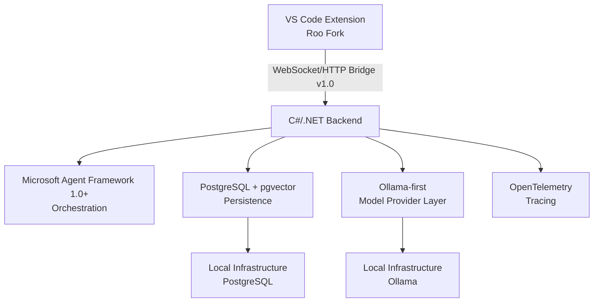

# Chroma Agentics Target Architecture

*Local-first, orchestrated AI development workflows — C#/.NET backend + Microsoft Agent Framework 1.0+ + PostgreSQL/pgvector + Ollama*

**Version:** 1.6 (Phase 2 Build Specification — Final Polished)  
**Maintained by:** KC Optimal Computing LLC  
**Status:** Phase 2 build specification. This document provides the exact blueprint required to begin implementation of the backend foundation. It is aligned with the project README’s early-development status, Core vs Experimental Scope, Phase 1–2 priorities, Security & Privacy Model, and Near-Term Priorities.

---

## 1. Design Principles (Non-Negotiable)

- **Local-first & privacy-preserving:** Ollama + PostgreSQL + localhost binding are defaults. Cloud providers are strictly opt-in.
- **Durable & observable:** Agent execution, checkpoints, and tool calls are persisted with OpenTelemetry tracing.
- **Explicit orchestration:** Microsoft Agent Framework 1.0+ provides structured multi-agent workflows with checkpointing and human-in-the-loop support.
- **Separation of concerns:** VS Code extension handles UI, approvals, and file/terminal execution; C# backend handles orchestration, persistence, and model access.
- **Extensible without breakage:** Clear boundaries for future LangGraph/n8n/Next.js layers (exploratory/roadmap).
- **Pragmatic for small teams:** Simple `docker-compose` + `.env.example` local development.

---

## 2. High-Level Architecture



### Plain-text fallback (for PDF/GitHub rendering — fully text-rendered)

```text
VS Code Extension (Roo Fork)
   │ (WebSocket/HTTP Bridge v1.0)
   ▼
C#/.NET Backend
   ├── MAF 1.0+ Orchestration
   ├── PostgreSQL + pgvector Persistence
   ├── Ollama-first Model Layer
   └── OpenTelemetry
   │
   ▼
Local Infrastructure (Ollama + Postgres)
```

### Key boundaries (formalized in `docs/API_CONTRACT.md`)

Backend proposes file/terminal actions. Extension presents diffs/commands and collects user approval. Approved actions execute exclusively through Roo Code’s inherited approval/tooling path.

---

## 3. Component Design

### 3.1 VS Code Extension Layer

- Preserves all Roo Code modes, webview, checkpoint navigation, and MCP integration.
- New “Orchestrator” mode delegates long-running workflows to backend.
- Configuration for backend endpoint, model selection, and approval policies.
- Event streaming of workflow status and checkpoints.

### 3.2 C#/.NET Backend Service

- ASP.NET Core minimal API + WebSocket middleware.
- Hosted as container, Windows Service, or Linux systemd.
- **Orchestration:** Microsoft Agent Framework 1.0+ (production-ready; packages/API patterns may evolve → pin versions and isolate behind internal interfaces/abstractions).
- **Persistence:** EF Core Code-First migrations against PostgreSQL + pgvector.

### 3.3 Extension ↔ Backend Protocol (v1.0)

- **Transport:** Primary WebSocket (JSON messages); HTTP fallback for health/poll.
- **Envelope (every message):**

```json
{
  "protocolVersion": "1.0",
  "messageId": "uuid-string",
  "workspaceId": "uuid-string",
  "workflowId": "uuid-string",
  "sessionId": "uuid-string",
  "sequence": 42,
  "name": "workflow.start | checkpoint.propose | approval.request | event.ack | ...",
  "correlationId": "uuid-string",
  "idempotencyKey": "uuid-string",
  "timestamp": "ISO-8601",
  "payload": { }
}
```

- **Reconnect / replay semantics:** On reconnect the extension sends `session.resume` with `sessionId`, `workflowId`, and `lastSeenSequence`. Backend replays all missed events with `sequence > lastSeenSequence` in order.
- **ACK semantics:** ACKs are cumulative. Extension sends `event.ack` with `sessionId`, `workflowId`, and `lastSeenSequence`. `lastSeenSequence` means all events up to and including that sequence were received and processed by the extension. ACK confirms receipt and processing of events (distinct from approval). Backend tracks ACKs for reliable delivery and replay.
- **Key message types:** `workflow.start`, `workflow.status`, `checkpoint.propose`, `approval.request`, `approval.decision`, `tool.propose`, `rag.retrieve`, `model.stream`, `event.ack`, `error`.
- **Cancellation:** `workflow.cancel` with graceful shutdown.
- Full HTTP OpenAPI spec, WebSocket message JSON Schemas, and optional AsyncAPI documentation will live in `docs/API_CONTRACT.md`.

### 3.4 Approval Flow Object Shapes

#### ApprovalRequest (sent by backend)

```json
{
  "approvalId": "uuid",
  "workflowId": "uuid",
  "stepId": "uuid",
  "actionType": "file.edit | terminal.command | mcp.tool",
  "riskLevel": "low | medium | high | critical",
  "summary": "string",
  "patchSetId": "uuid (optional)",
  "command": "string (optional)",
  "toolCall": { "...": "optional" },
  "requestedByAgent": "string",
  "requestedAtUtc": "ISO-8601"
}
```

#### ApprovalDecision (sent by extension)

```json
{
  "approvalId": "uuid",
  "decision": "approved | rejected | modified",
  "userId": "string",
  "reason": "string (optional)",
  "decidedAtUtc": "ISO-8601",
  "modifiedPatchSet": { "...": "optional when modified" }
}
```

### 3.5 Database Schema (PostgreSQL + pgvector)

Core tables (EF Core Code-First; migrations in `db/migrations/`):

- `Workspaces`
- `WorkflowExecutions`
- `WorkflowSteps`
- `ExecutionEvents`
- `ToolCalls`
- `ApprovalRequests`
- `ApprovalDecisions`
- `PatchSets`
- `ProviderConfigs`
- `ModelCapabilities`
- `AuditEvents`
- `RAGDocuments`
- `RAGChunks`
- `EmbeddingRecords`

### 3.6 Provider Secret Storage Policy

- **Preferred:** Environment variables, OS keychain, .NET User Secrets, or external secret manager (Azure Key Vault, HashiCorp Vault, etc.).
- **Encrypted DB storage (if used):** AES-256 with per-workspace keys; key rotation procedure and strict access controls must be documented in `docs/SECURITY.md`. Secrets are never logged or exposed in telemetry.

### 3.7 Local Authentication Bootstrap

- **Default:** localhost-only binding.
- **Development token:** Generated local token or simple development token (stored in VS Code SecretStorage).
- **WebSocket handshake:** Token required for every connection.
- **LAN mode:** Explicit opt-in configuration (non-default) with additional controls.
- Full details and rotation procedure in `docs/SECURITY.md`.

---

## 4. Non-Functional Requirements (Measurable Targets)

Benchmark hardware tiers (inference targets reported per model and tier):

- **CPU-only** (modern laptop, 32 GB RAM)
- **GTX 1070 / 8 GB VRAM + CPU offload**
- **Modern 12 GB+ GPU** (RTX 40-series or equivalent)
- **Cloud/provider fallback** (for comparison only)

Targets (Ollama 7B–13B models):

- **RAG retrieval:** p50 < 300 ms, p95 < 500 ms
- **Inference first-token:** p50 < 800 ms, p95 < 2 s (streaming)
- **Workflow checkpoint round-trip:** p95 < 1 s

---

## 5. Failure-Mode Behavior

- **PostgreSQL down:** Reject new durable workflows immediately. Existing workflows pause at the next safe checkpoint. No approval or tool execution is allowed without persistence. In-memory degraded mode is limited to diagnostics and status queries only.
- **Backend restart:** MAF sessions and PostgreSQL state survive; extension auto-reconnects with replay.
- **Extension disconnect:** Backend pauses workflow at next checkpoint; resumable on reconnect.
- **Ollama down:** Provider marked unhealthy; error surfaced to extension with retry/fallback option.
- **Rejected approval:** Workflow pauses or branches per agent configuration.
- **Invalid model output / tool timeout:** MAF retry policy + validation middleware; escalate to human if exhausted.

---

## 6. Health Endpoints

- `/health/live` — Liveness: the process is running.
- `/health/ready` — Readiness: depends only on required configured dependencies.
- `/health/dependencies` — Detailed status of PostgreSQL, Ollama, and other dependencies. Optional providers appear here and only block readiness when actively configured as required.

---

## 7. Testing Strategy

- Extension smoke tests, backend unit tests, API contract tests, WebSocket reconnect tests, provider adapter tests, EF migration tests, RAG retrieval evaluation, approval workflow E2E test, security/redaction tests.
- Phase 2 exit requires health endpoint + basic streaming + contract tests passing.

---

## 8. Security & Privacy Notes

- Best-effort redaction middleware for logs/traces/telemetry.
- Redaction does not replace the practice of minimizing sensitive data in telemetry.
- Default: localhost-only binding.
- Full threat model in `docs/SECURITY.md`.

---

## 9. Phase Alignment & Phase 2 Deliverables

**Phase 1 (Fork & Baseline):** In progress. Will be marked complete only after successful build, launch, core behavior verification, branding, license/NOTICE, and regression checks.

### Phase 2 Deliverables (Backend Foundation)

| Deliverable | Description | Acceptance Criteria |
|---|---|---|
| Backend skeleton | ASP.NET Core minimal API project | Compiles and starts locally |
| API contract | Full v1.0 protocol implementation | HTTP OpenAPI spec, WebSocket JSON Schemas, replay/ACK/approval contract tests pass |
| WebSocket bridge | Bidirectional JSON envelope handling | Reconnect/replay, ACK, and approval flow work |
| Health endpoints | `/health/live`, `/health/ready`, `/health/dependencies` | Automated tests pass |
| `.env.example` | Local development configuration | Documented and used by docker-compose |
| `docker-compose.yml` | PostgreSQL + backend services | Starts PostgreSQL and backend; Ollama is host dependency by default (optional containerized Ollama documented separately) |

---

This Phase 2 build specification is complete and ready to hand to a coding agent or contributor. All implementation boundaries, message shapes, failure modes, auth bootstrap, health checks, and deliverables are explicitly defined. The architecture diagram is now a clean, text-rendered Mermaid block (with plain-text fallback) that survives GitHub Markdown and PDF export.

**Ready for Phase 2 implementation.**

See `docs/ARCHITECTURE.md` (to be created) and issues labeled `backend` or `api-contract`.

*Chroma Agentics — Building a credible, local-first agentic development platform on top of a proven foundation.*

For questions or involvement in the Kansas City AI tooling community, open a GitHub issue.
